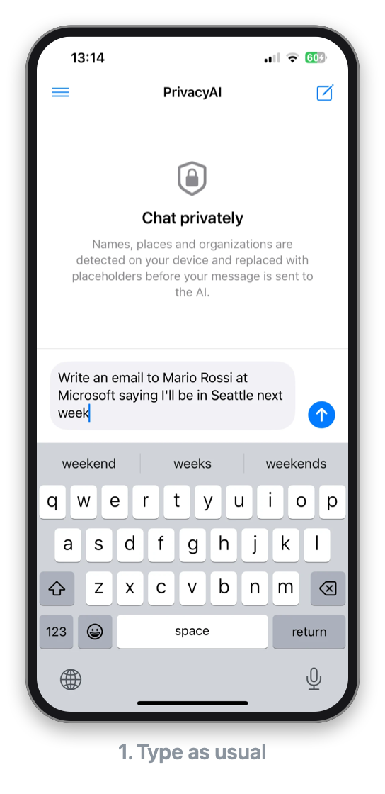
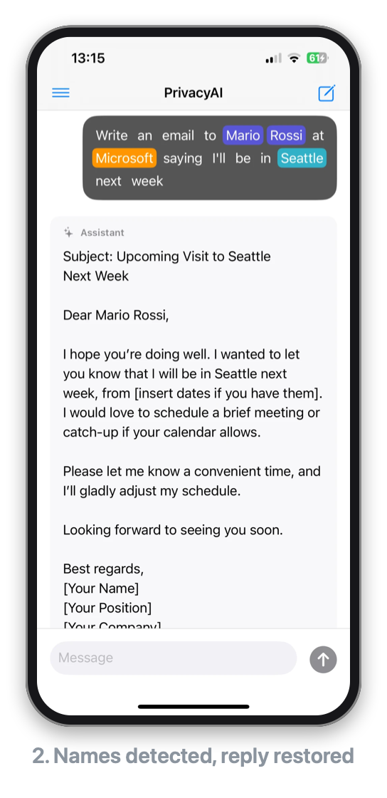
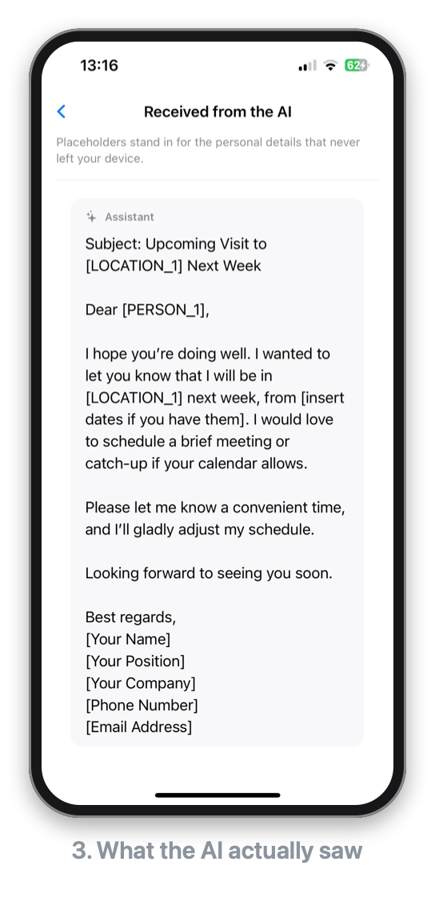
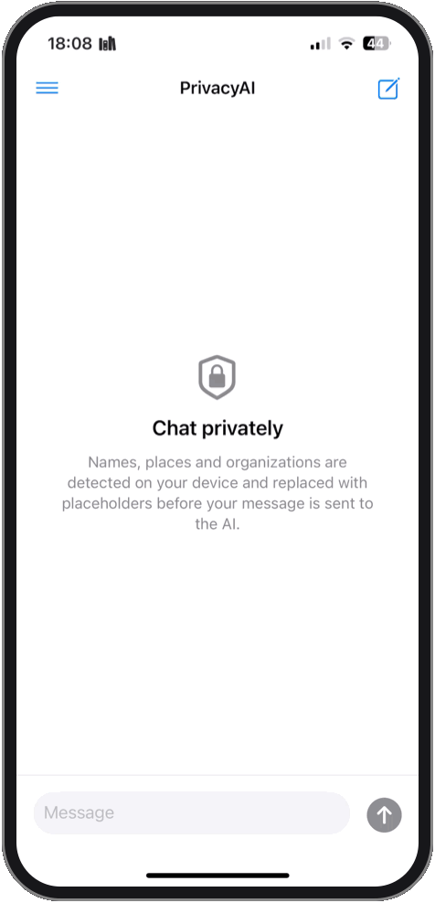
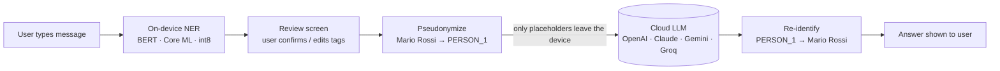

# PrivacyAI

**Talk to any LLM without handing over your personal data.**

PrivacyAI is an iOS chat client that sits between you and cloud LLMs (OpenAI, Anthropic, Google Gemini, Groq). Before a message leaves the device, an **on-device BERT NER model running on Core ML** finds personal information (names, places, organizations) and replaces it with placeholders. The LLM only ever sees the pseudonymized text. When the answer comes back, the app swaps the real values back in, so the conversation still reads naturally to you.

<p align="center">
  
  
  
</p>

---

## Why

People paste emails, contracts and medical notes into chatbots every day. Once that text reaches a third-party API, you no longer control it. PrivacyAI keeps the useful part (the LLM's reasoning) and keeps the sensitive part (who, where, which company) on your phone.

## Demo

<p align="center">
  <br>
  <sub><a href="https://github.com/user-attachments/assets/58619d04-20ab-4703-93d1-8d9ad2669588">▶ Watch the full-quality video</a></sub>
</p>

## How it works



### Example

**You type:**

> Write a short email to Mario Rossi at Microsoft saying I'll be in Seattle next week

**The LLM receives** (this is all that leaves the device):

> Write a short email to [PERSON_1] at [ORG_1] saying I'll be in [LOCATION_1] next week

**The LLM replies** (real output):

> Subject: Quick Update – I'll Be in [LOCATION_1] Next Week
>
> Hi [PERSON_1],
>
> I wanted to let you know that I'll be in [LOCATION_1] next week. Please let me know if you'd like to catch up while I'm there.
>
> Best,<br>
> [Your Name]

**You see** (placeholders restored on-device):

> Subject: Quick Update – I'll Be in Seattle Next Week
>
> Hi Mario Rossi,
>
> I wanted to let you know that I'll be in Seattle next week. Please let me know if you'd like to catch up while I'm there.
>
> Best,<br>
> [Your Name]

`[Your Name]` is the LLM's own template placeholder, not one of the app's: only aliases the app created are replaced.

### Pipeline

1. **Detect.** The message is tokenized with a bundled WordPiece tokenizer and run through a BERT token-classification model ([`dslim/bert-base-NER-uncased`](https://huggingface.co/dslim/bert-base-NER-uncased), converted to Core ML with int8 weights, ~105 MB). Sub-word pieces are merged back into words and BIO labels (`B-PER`, `I-PER`, `B-LOC`, …) are grouped into entities. Messages longer than the model's 128-token window are split on word boundaries.
2. **Review.** Before sending, you see the message with every detected entity highlighted. Tap any word to add, change or remove a tag. The model suggests, you decide.
3. **Pseudonymize.** Consecutive tagged words form one entity (`Mario Rossi` → `[PERSON_1]`) and each entity keeps the same placeholder for the whole conversation. Punctuation and possessives are preserved (`Mario's,` → `[PERSON_1]'s,`). Words masked earlier stay masked even if the model misses them in a later message.
4. **Call the LLM.** The pseudonymized conversation is sent to the provider you configured. A system prompt tells the model to reuse placeholders verbatim.
5. **Re-identify.** Placeholders in the reply are replaced with the original values (longest alias first, so `[PERSON_10]` is never mangled by `[PERSON_1]`).
6. **Audit.** Long-press any message and choose **What the AI saw** to see exactly what was sent or received.

## Features

- On-device PII detection with Core ML. No extra server, and raw text is never sent anywhere for analysis.
- Human-in-the-loop review screen with per-word tagging.
- Reversible pseudonymization with conversation-scoped aliases, saved with the chat so old conversations still re-identify after a restart.
- Multi-turn conversations: the full history is sent, always masked.
- Multi-provider support: OpenAI, Anthropic, Google Gemini and Groq. The provider is **auto-detected from the API key format**, with a manual override and a configurable model name.
- API key stored in the **iOS Keychain**. Chat history stored on-device only, with file protection enabled.
- Markdown and code-block rendering in replies.

## Tech stack

| Layer | Technology |
|---|---|
| UI | SwiftUI, custom `Layout` (flow layout for per-word chips) |
| State | MVVM, `ObservableObject`, Swift Concurrency (`async/await`, `@MainActor`, detached tasks for inference) |
| ML inference | Core ML (`mlprogram`, int8 weight quantization) |
| Tokenization | [`swift-transformers`](https://github.com/huggingface/swift-transformers), loaded from bundled files (works offline) |
| Model conversion | PyTorch → TorchScript → `coremltools` |
| Networking | `URLSession` + `Codable`, no third-party SDKs |
| Security | Keychain Services, `Data.WritingOptions.completeFileProtection` |
| Tests | Swift Testing |

## Project structure

```
PrivacyAI/
├── PrivacyAIApp.swift
├── Models/                 # Message, WordToken, ChatSession, EntityCategory
├── Privacy/
│   ├── EntityRecognizer.swift   # Core ML NER: tokenize → infer → BIO decode
│   └── Pseudonymizer.swift      # Masking, alias vault, re-identification
├── Services/
│   ├── ChatStore.swift          # On-device chat history
│   ├── KeychainStore.swift
│   └── LLM/                     # Provider detection, HTTP client, wire models, errors
├── ViewModels/ChatViewModel.swift
├── Views/
│   ├── Chat/        # Chat screen, message rendering, "What the AI saw" panel
│   ├── Review/      # Pre-send review screen, word chips, FlowLayout
│   ├── Sidebar/     # Chat history
│   └── Settings/
└── Resources/       # tokenizer.json, tokenizer_config.json
PrivacyAITests/      # Unit tests (pseudonymization, tagging, provider detection, …)
ml/                  # Python script that builds the Core ML model
```

## Getting started

### Requirements

- Xcode 16 or later
- iOS 17.4+ (device or simulator)
- Python 3.10+ (only to build the model)
- An API key from at least one supported provider

### 1. Build the Core ML model

The model weights (~105 MB) are too large for a Git repository, so they are generated locally:

```bash
pip install -r ml/requirements.txt
python ml/convert_bert_ner.py
```

This downloads `dslim/bert-base-NER-uncased`, converts it to Core ML, quantizes the weights to int8 and writes `PrivacyAI/BertNER.mlpackage`. Xcode picks it up automatically. Without the model the app still runs, and you tag words by hand on the review screen.

### 2. Run

Open `PrivacyAI.xcodeproj`, select a simulator or device and press **Run**. Swift Package Manager resolves `swift-transformers` on the first build. Press **⌘U** to run the tests.

To run on a physical device, select your own team and a unique bundle identifier under **PrivacyAI target → Signing & Capabilities**.

### 3. Add your API key

Open **Settings** from the chat history sidebar and paste a key. The provider is detected from the prefix (`sk-ant-`, `sk-`, `AIza`, `gsk_`), or you can pick it manually. You can also override the default model for each provider.

## Development

A pre-commit hook blocks commits that contain something that looks like an API key. Enable it once per clone:

```bash
git config core.hooksPath .githooks
```

## Limitations & roadmap

- [ ] **English-only NER.** Add a multilingual model (for example `Davlan/distilbert-base-multilingual-cased-ner-hrl`) and pick one based on the detected language.
- [ ] **Structured PII.** Add a regex layer for emails, phone numbers, IBANs and tax codes, which the NER model does not cover.
- [ ] **Streaming replies.** Show tokens as they arrive; this needs re-identification to handle placeholders split across chunks.
- [ ] **Partial matches.** "Mario Rossi" and a later "Rossi" get different placeholders. Linking them would need coreference resolution.
